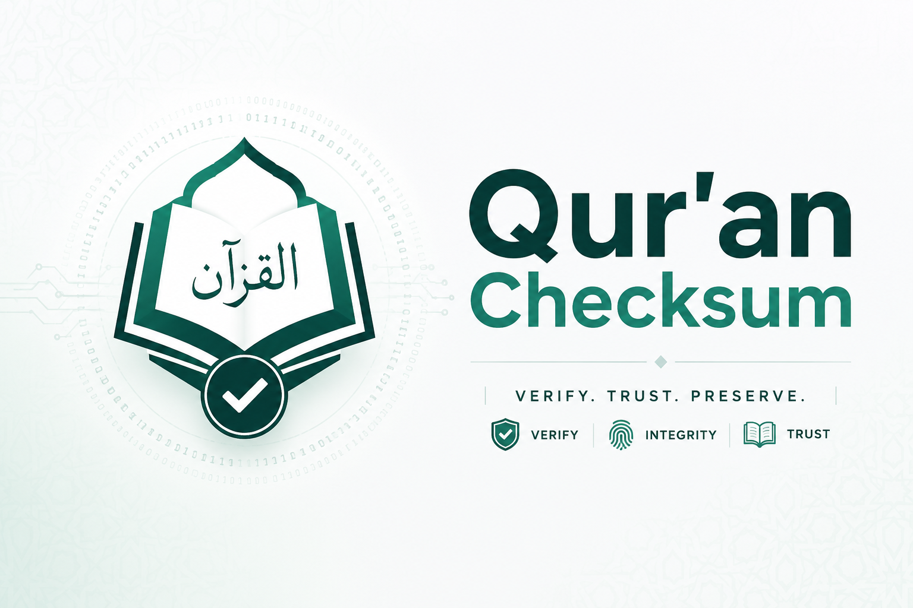

# quran-verify



Verse-level SHA-256 integrity manifest for the Quran (Uthmani script, Ḥafṣ
ʿan ʿĀṣim), plus scripts to generate and check it.

## What this is

A small, boring piece of infrastructure: a JSON manifest that maps every
verse (`surah:ayah`) to a SHA-256 hash of its canonical text, rolled up into
per-surah and whole-Quran root hashes. It lets any app, pipeline, or script
answer *"is this exactly the text it's supposed to be?"* without a human
reading it letter by letter.

This is **not** a new Quran text, a new encoding scheme, or a claim about
which edition is "correct." It is a checksum layer over the existing,
widely-used [Tanzil](https://tanzil.net) Uthmani text, which is itself a
transcription of the **Madinah Mushaf** published by the **King Fahd
Glorious Qur'an Printing Complex** (KFGQPC), verified by Tanzil against it
using manual verse checksums during their text preparation.

**Full provenance chain, stated precisely, in
[`docs/PROVENANCE.md`](docs/PROVENANCE.md)** — including exactly what is
and isn't a direct KFGQPC-sourced claim. Read this before citing or
publishing anything built on this manifest; it matters for a project in
this space to be exact about sourcing rather than implying more official
backing than actually exists.

## What it's for

- **App build-time integrity checks** — verify bundled Arabic text hasn't
  been corrupted by a font pipeline, bad copy/paste, or bad export.
- **OCR / extraction verification** — when digitizing print sources or
  scraping text, catch corruption or scan errors against known-good hashes
  before they enter a pipeline.
- **Cross-source sanity checks** — quickly tell whether two copies of "the
  Quran text" are byte-identical after normalization, and if not, exactly
  which verse(s) differ.

See [`docs/SPEC.md`](docs/SPEC.md) for exactly what is and isn't guaranteed
by a match, and [`docs/USE_CASES.md`](docs/USE_CASES.md) for worked examples.

## Quick start

```bash
# Verify a Tanzil-format text file against the published manifest
python3 scripts/verify.py your-quran-text.txt --manifest manifest/quran-uthmani.manifest.json
```

Exit code `0` = every verse matches. Exit code `1` = mismatches printed with
exact verse keys and both hashes, so you can locate the problem immediately.

```bash
# Regenerate the manifest from a source file (e.g. to check a new Tanzil release)
python3 scripts/generate_manifest.py your-quran-text.txt --out manifest/new.manifest.json
```

## Translations

Translation manifests live under `manifest/translations/` (e.g.
`manifest/translations/en.sahih.tanzil.manifest.json`). They use the exact
same hashing scheme as the Arabic text manifest, with two differences:

- They are **hash-only** — no translation text is ever stored in this
  repository, since translations (unlike the Quran's Arabic text) are
  copyrighted. See [`docs/PROVENANCE.md`](docs/PROVENANCE.md#translations).
- They are **non-canonical** — a match confirms your copy is byte-identical
  to one named distributor's copy at one retrieval date, not that the
  translation itself is correct or official. See
  [`docs/SPEC.md`](docs/SPEC.md#translation-manifests).

```bash
# Generate a translation manifest
python3 scripts/generate_manifest.py your-translation.txt \
  --kind translation --meta-file en-sahih-meta.json \
  --out manifest/translations/en.sahih.tanzil.manifest.json

# Regenerate the translations catalog after adding/updating manifests
python3 scripts/build_index.py
```

## Input format

Tanzil-style pipe-delimited text, one verse per line:

```
1|1|بِسْمِ ٱللَّهِ ٱلرَّحْمَٰنِ ٱلرَّحِيمِ
1|2|ٱلْحَمْدُ لِلَّهِ رَبِّ ٱلْعَٰلَمِينَ
```

This is the format Tanzil's own downloads use, so no conversion is needed
for the most common source.

## What's in this repo

```
manifest/quran-uthmani.manifest.json   the published manifest (generate this yourself, verify it matches)
manifest/translations/                 translation manifests + index.json catalog (hash-only, non-canonical)
scripts/generate_manifest.py           build a manifest from a source text file (Arabic text or translation)
scripts/build_index.py                 regenerate manifest/translations/index.json
scripts/verify.py                      check a source text file against a manifest
docs/SPEC.md                           normalization rules, what a hash match/mismatch means
docs/USE_CASES.md                      worked examples: build check, OCR check, tamper detection
docs/PROVENANCE.md                     exact chain of custody: KFGQPC standard -> Tanzil -> this manifest
```

## Status & scope

This is a first release of the verse-level layer only. It does **not**
include:
- Cross-edition comparison (Tanzil vs Quran.com vs others) with severity
  grading of differences — a real and useful next step, not done here.
- Word- or grapheme-level structural analysis (rasm/dots/vowels, written vs
  recited letters) — a related but separate project; word/grapheme-level
  diagnosis of a *failing* verse is a natural extension, not included yet.
- Endorsement or review by any Quranic institution. Treat this as a useful
  utility, not an authority. Corrections and review are very welcome —
  please open an issue.

## License

MIT. Do whatever's useful with it.

## Acknowledgements

Built on the [Tanzil Project](https://tanzil.net)'s Uthmani text. Tanzil's
own documented verification process — comparing digital text against the
Madinah Muṣḥaf with manual checksums — is the direct inspiration for this
tool; this project is an attempt to make that kind of check reusable rather
than a one-time internal step.
